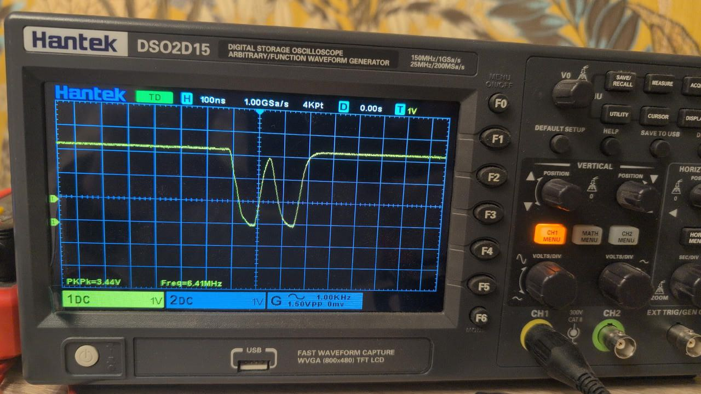
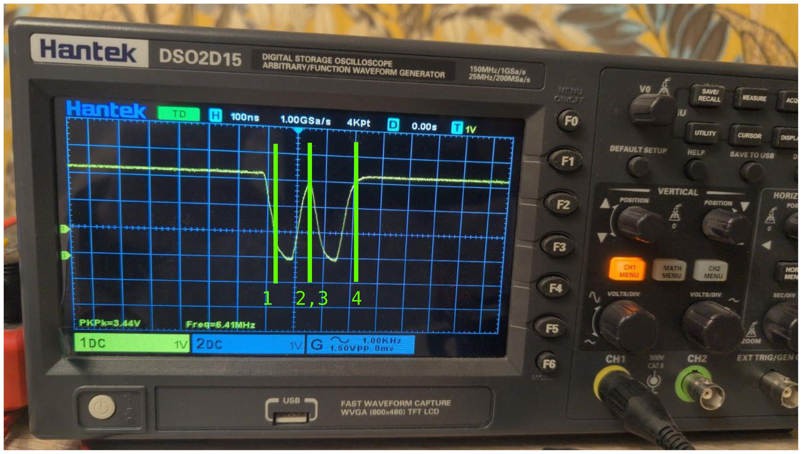
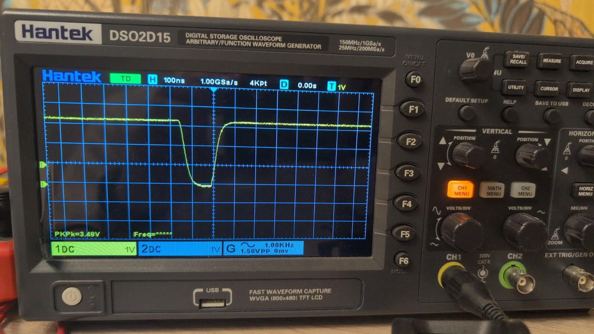

*v1.0. 2026-03-11*

# So, why, again, do we need DSB. ARM Store Buffer;

## TL; DR

- Take STM32H7 with Cortex-M7;
- Cortex-M7 uses [Store Buffer](https://www.systemonchips.com/armv7-store-buffer-behavior-and-data-coherency-issues-in-single-and-multi-core-systems/). This is a temporary storage where the values go before they've written into memory. It is different from cache.
- Cache operations are write-through. But the memory mapped to peripherals is not cacheable, so it doesn't even matter when we work with STM32's peripherals;
- We would think that once we write something to a peripheral register, it gets updated at once. This assumption is wrong because of Store Buffer, and the processor's pipeline;

## Preface

Consider an example ISR handler;

```c++
// A debug GPIO

debugGpio1->write(false);

// PR register shows which EXTI lines are pending;

const uint32_t pr = EXTI->PR1;

// Clear EXTI update

LL_EXTI_ClearFlag_0_31(LL_EXTI_LINE_10 | LL_EXTI_LINE_11 | LL_EXTI_LINE_12 | LL_EXTI_LINE_13 | LL_EXTI_LINE_14 |
	LL_EXTI_LINE_15);

// (1)
// __DSB();

// My own custom ISR handler;

handleInterrupt(pr, Stm32EdgeInterrupt::ExtiInterrupt10to15);

debugGpio1->write(true);
```

- Here is what we expect. Upon exiting the ISR, `EXTI->PR` will be reset. So no new ISRs will be triggered until an event pops up, and `EXTI->PR` gets updated by the hardware. Each time an EXTI line gets trigger, our ISR runs;
- Seems like everything is OK: `EXTI` is a `volatile` typedef, it won't be optimized out. The ISR is indeed reset;
- However, here is what we get:



## What happened, version 1



At a first glance, it's obvious;

1. We got an EXTI update. An ISR got triggered. We reset `EXTI->PR`
2. We exited the ISR;
3. We got another EXTI update;
4. We processed this another EXTI update;

Right? Wrong. There were no EXTI updates;

## What happened, version 2

1. We got an EXTI update. An ISR got triggered. We reset `EXTI->PR`;
2. The value that supposed to be in `EXTI->PR` goes into ARM store buffer;
3. The peripheral triggers ISR, because its register still signals pending event;
4. We exit `EXTI->PR`. By this time, the value finally reaches the destination;

## `DSB` comes to rescue;

Here is what happens when we add DSB;

```c++
debugGpio1->write(false);

const uint32_t pr = EXTI->PR1;

// Clear EXTI update

LL_EXTI_ClearFlag_0_31(LL_EXTI_LINE_10 | LL_EXTI_LINE_11 | LL_EXTI_LINE_12 | LL_EXTI_LINE_13 | LL_EXTI_LINE_14 |
	LL_EXTI_LINE_15);

// (1)
__DSB();

handleInterrupt(pr, Stm32EdgeInterrupt::ExtiInterrupt10to15);

debugGpio1->write(true);
```

And now, we get the correct picture.



## Why `DSB` solves the issue.

From STM's "The Cortex-M7 instruction set"

> DSB acts as a special data synchronization memory barrier. Instructions that come after the  DSB, in program order, do not execute until the DSB instruction completes. The DSB  instruction completes when all explicit memory accesses before it complete.

The same in English:

- There is a processor's pipeline.  An instruction entering the pipeline is not executed immediately;
- There also is a thing called Store Buffer. For write operations, the following holds: when we store (`STR`) something somewhere, this something may stay for some time in Store Buffer;
- `DSB` "completes when all explicit memory accesses before it complete", and no following instructions execute before `DSB`. In other words, (1) if there is an instruction before `DSB`, it WILL be through the entire pipeline before DSB. (2) if there is an instruction after `DSB`, it will not execute until `DSB` is executed.
