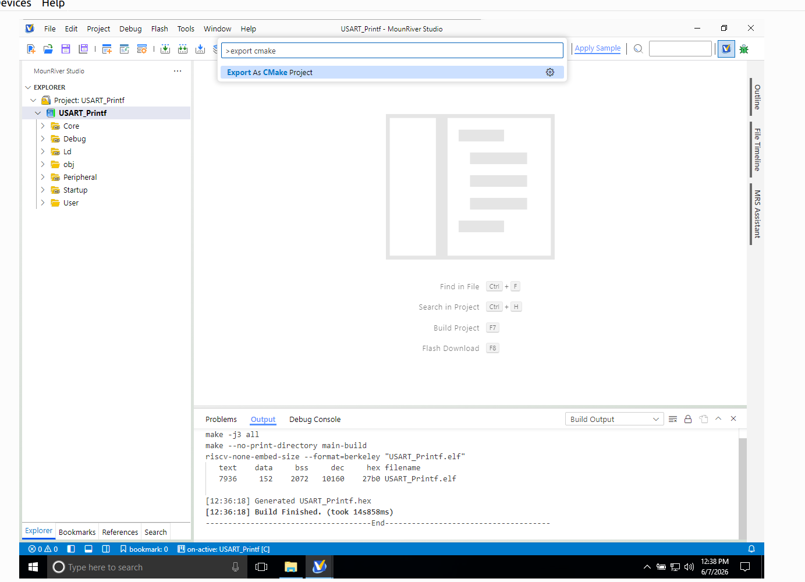
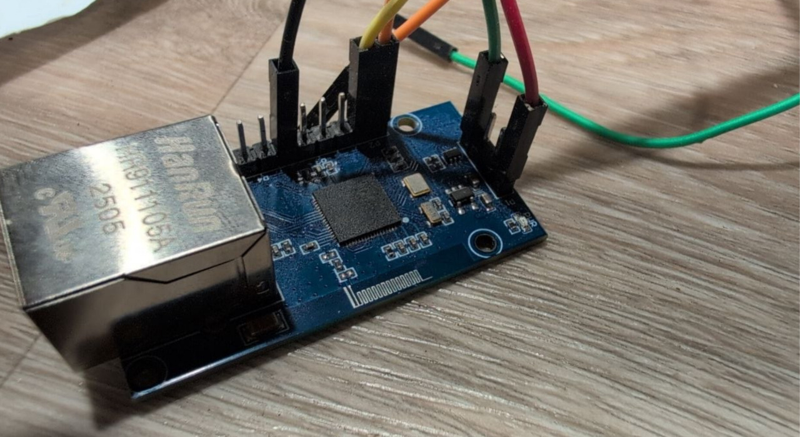
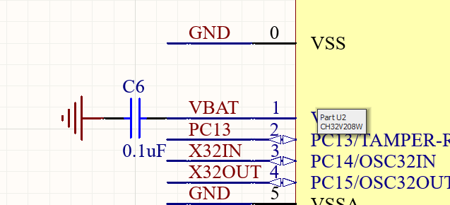
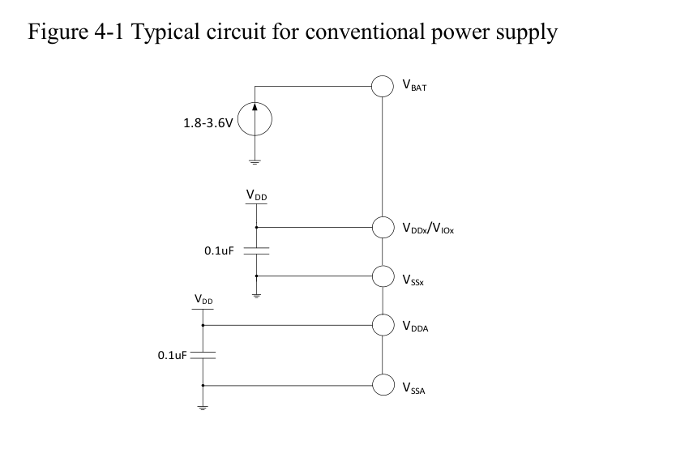
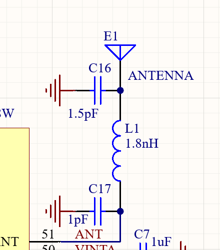

# What is this projects about

- an attempt to develop an alternative solution to meshtastic devices, usually built on ESP32, or nRF52
- port the meshtastic stack on the device
- make it compatible w/ the meshtastic application
- probably, make an alternative meshcore firmware

Usefulness. Why doing something like that

- no real economical reasons. Just want to poke into this Chinese phenomenon. It's cool
	- i can see to what extent I can reproduce whatever lilygo, or heltec have done, but with this little stone.
- if you have some practical objectives, just use ESP32. If all you need is connectivity, there's nothing better. It's tried, and through, it's dirt-cheap, it's powerful, it's efficient because you can offload something to the low power co-processor if you need to, it arguably has the greatest community ever, and the software support is outstanding. Thus far, it's the best

Why v208

- cheap chinese micro, but 128K flash, 64K RAM, Ethernet PHY (10Mb though), BLE, USB
- cheaper than ESP.
	- Hopefully (TODO DM validate that, see current consumption, and voltage), more efficient. That's a non-goal anyway

# Relevant links

- wch32 reference
- wlink
- minichlink
- mounriver studio
	- do you trust some obscure closed-source IDE from China to run bare-metal on your machine?
- debugger
- the toolchain
- AppCAD
- example schematics

# Gettingstarted

- getting the debugger
- building minichlink, and wlink
- exporting CMake project from MounRiver studio
	- greatest kudos to them for the HAL, and for the out-of-the-box experience
	- And for exporting it as a plain CMake project. Keil, take a note, no? 
- building from example
- exporting the cmake project
- configuring the debugger
	- attach vscode configuration too
- running the example
- examining the example, and the reference manual
	- no description to the radio part (AFAIK, same thing w/ ESP?)
	- everything about configuring the hardware is in `.a` file. Have no interest into reverse engineering it yet; [REF01]{#ref01}
- poking into meshtastic firmware
	- wtf is GATT
	- getting the bits I need
	- nanopb

# Sides

- reversing the BLE .a lib??? [REF01](#ref01)

# Drawing a PCB

- I don't have the pins I need (namely UART, and SPI) on the header;
- I have a fine insulated wire for E-motors, but soldering it to the board is a challenge;
- Keeping this debug setup working -- even more so;
- So I draw my own PCB for that initial debugging step;

Rev. 1.

- It's gonna have power, USB connector, and convenient debug header connected to SPI, UART, and SWD.

How?

- Good news: WCH provides schematics for their evaluation boards, that includes CH32V208.
- Bad news, well...

- ... even I do know it ain't gonna fly. Here is what it should look like:

- First, KiCad only provides symbols for a tiny subset of CHVx product line. This is where [this repository](https://github.com/Taoyukai/wch_kicad_library.git) comes to the rescue;
	- And it also has footprints for on-PCB antennas. `@Taoyukai`, respect, kudos, peace!

The RF!

- Second, I have absolutely zero practical experience with RF, and shaky understanding of theoretical underpinnings thereof. However, many electronics engineers, awesome as they are, work with generic stuff 99% of the time, and allow themselves to treat RF as magic anyway, so I like my chances. REF02: I started with [this video](https://www.youtube.com/watch?v=e0eY1L77A-E).
	- AppCAD. Seems like I have to play with the geometry;
- The vendor provides parameters for the antenna

- Topologically, it does resemble the antenna from the video (REF02), and it matches what I see on the evaluation board except for the fact that the caps are not there, and the inductor is replaced with 0 Ohm