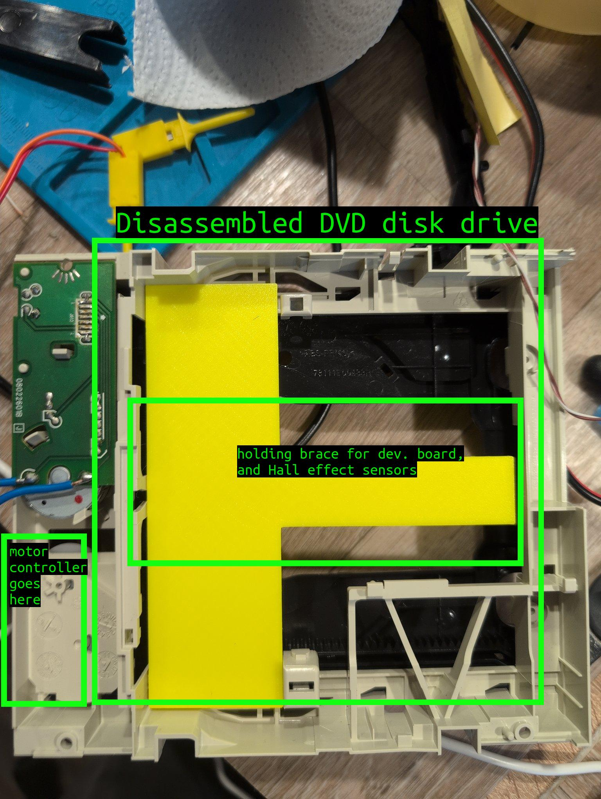
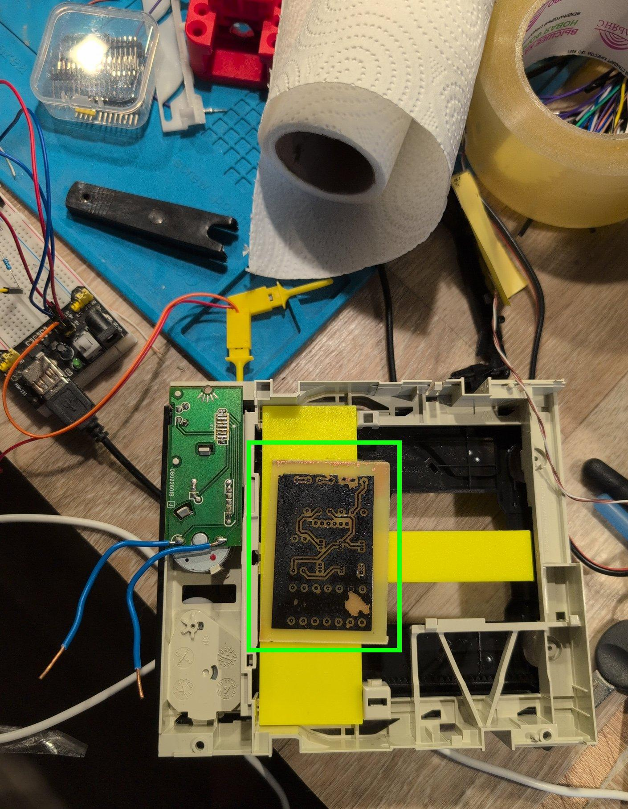
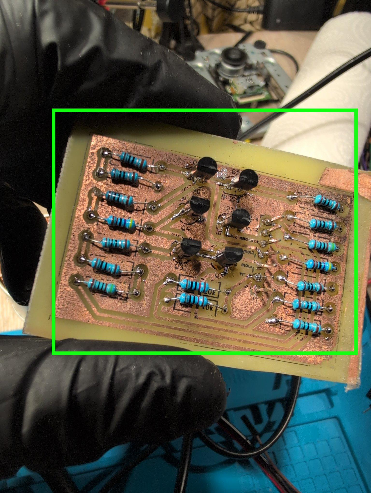
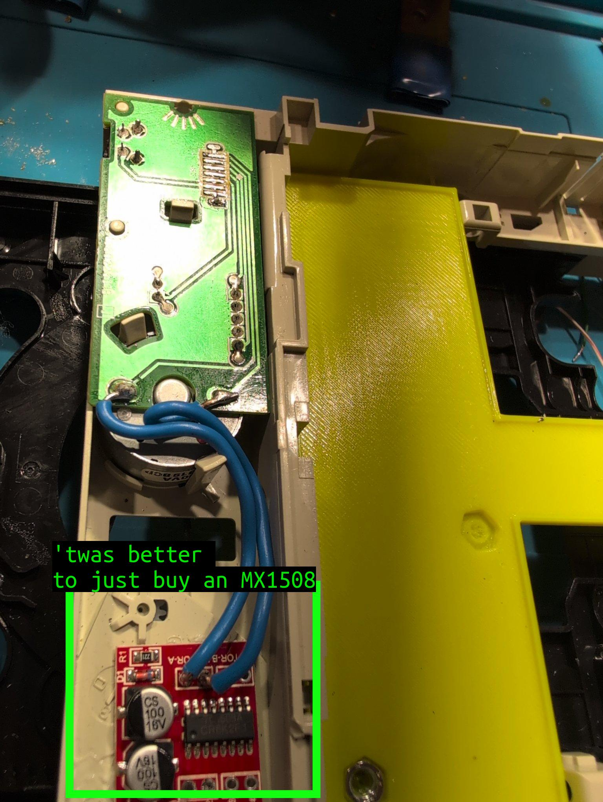
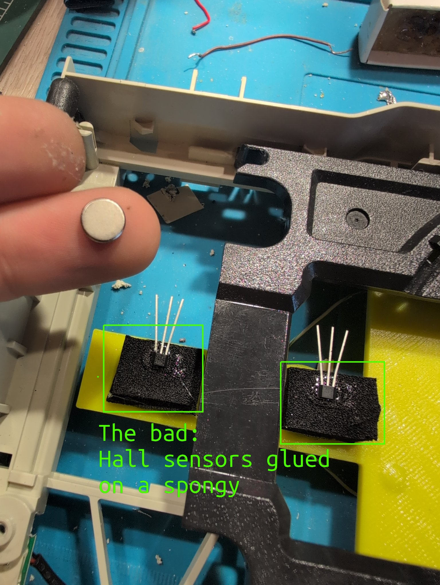
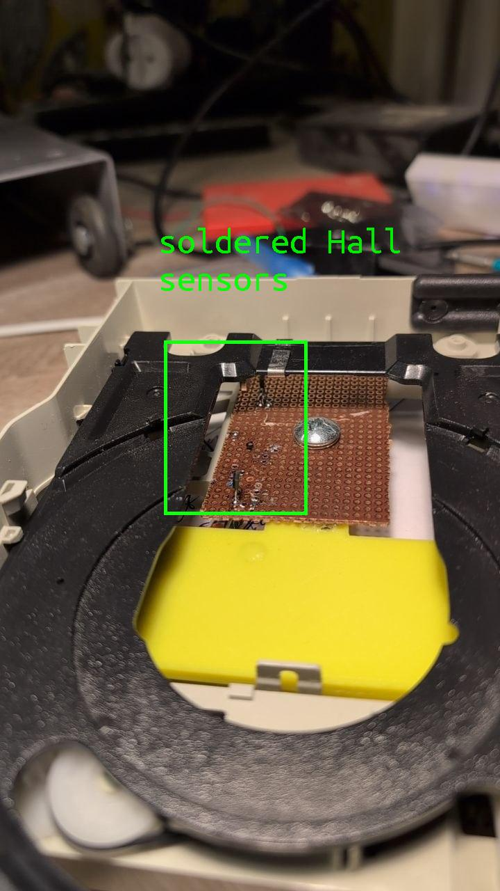
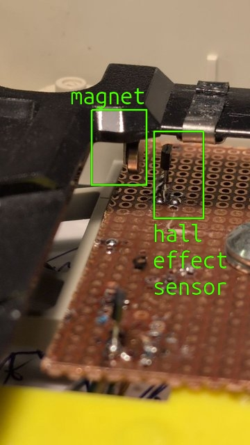

# What is this project about

- I use ferric chloride to etch PCBs;
- It requires lengthy shaking. The process is boring;
- So I made a shaker of an old DVD disk drive. It's powered by a simple USB charger, and is powerful enough to carry almost 1 kg (2.2 lbs) (!) of payload;

# The process

## Disk drive

I've started with taking whatever I need from an old DVD drive

The only thing I really needed was the motor, and the gear system. So everything
that was not it (the lens, laser, the drive mechanism) went away.

The motor board here provides commutation for an LED, a mechanical endpoint
detector, and the motor. However, it adds to rigidity, secures the motor in
place preventing wobbling, and really does not ask for anything in return. So I
decided to leave it where it was.

I needed a place to mount the controller, and endpoint detectors, so I printed a
big bright yellow T-brace.

## Driving the motor

One can just hook the 5V USB charger to drive the motor, and it's more than
enough to spin the thing. But I needed a back-and-forth movement for the task at
hand. One way to go about it is a spring mechanism. Will probably pan out, no
guarantees though. At least, besides the payload, the motor will have to pull
the spring too.

This would not add to the overall performance of the system, so I decided to
switch the polarity to change the direction. And for that, I
needed an [H-bridge](https://www.electronics-tutorials.ws/io/h-bridge-circuit.html).
More complex, but works.

Tried to make an H-bridge of my own with small-signal N3904 transistors, because
it was supposed to be faster than waiting (NO).

Failed. The reason is right in the name: "small-signal".

Didn't work out, so I went with an off-the-shelf IC called MX1508.

## Endpoints, and controller

It has to know where to stop. The initial idea was to create a metallic spring,
a metal plate, connect it to MCU pins, and use that to detect the endpoint. It
would work, but I didn't want to bother with the mechanics.

Hall effect sensors are way better. Such a sensor does not require precise
alignment of any sort, it doesn't degrade, or jam. The golden rule applies: the
system with the least moving parts is the most reliable. So that was what I went
with.

Initially, I glued them on a shock absorber (feels close to a sponge).

I immediately noticed a problem. The black brace that connects left, and right
side of the tray flexes. And with enough pressure applied, it's going to shave
against the sensors. So a more elegant solution was chosen.

Here is the overview

...

... and a close up

Now the magnet just slides next to the sensors. Any pressure coming from above
does not cause issues.

# The result

<video controls width="360" height="640">
  <source src="shaker/slider.mp4" type="video/mp4">
</video>

I've tested this with a 1kg payload, and it works just fine.

The next step is to add the proper casing, and test this in the field with the real PCB

# Links

- [Schematics](https://github.com/damurashov/etchant-shaker-h-bridge)
- [MX1508 datasheet](https://components101.com/sites/default/files/component_datasheet/MX1508-DC-Motor-Driver-Datasheet.pdf)
- [AH3503 Hall effect sensor datasheet](file:///home/dm/Downloads/AH3503.PDF)

